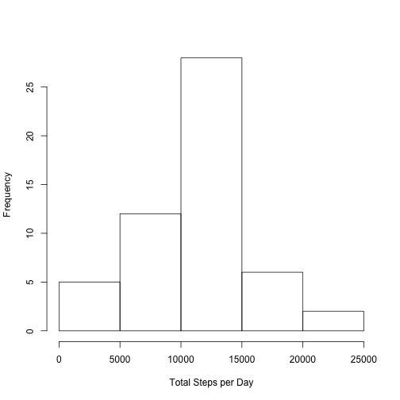
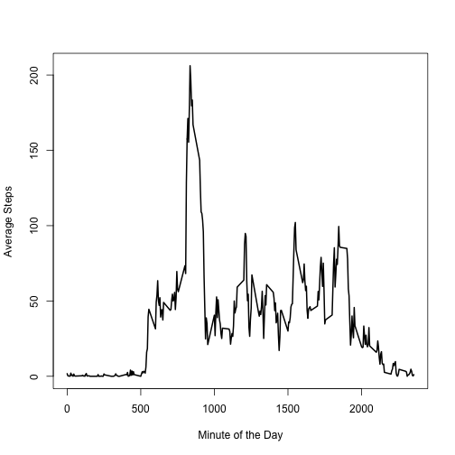
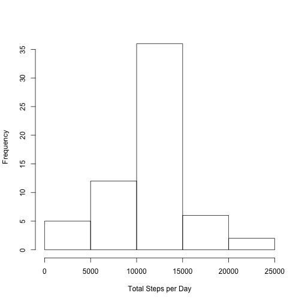
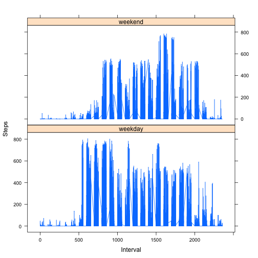

---
title: "Reproducible Research Project 1"
author: "Chris Loken"
date: "1/22/2017"
output: html_document
---

Import Libraries

```r
library(dplyr)
library(lattice)
```

**Loading and preprocessing the data:**
1. Load the data

```r
data <- read.csv('activity.csv')
```

**What is the mean total number of steps taken per day?**  

1. Calculate the total number of steps taken per day

```r
#remove missing values
data_daily <- subset(data, !is.na(steps))

#Group by date and create a histogram of the total steps per day
data_daily <- group_by(data_daily, date)
data_daily <- summarize(data_daily, steps=sum(steps))
```

2. Make a histogram of the total number of steps taken each day  

```r
hist(data_daily[['steps']], xlab="Total Steps per Day", main="")
```



3. Calculate and report the mean and median of the total number of steps taken per day


```r
mean_steps <- as.integer(mean(data_daily[['steps']]))
median_steps <- median(data_daily[['steps']])
```

  * Mean Steps Per Day: 10766  
  * Median Steps Per Day: 10765  
  

**What is the average daily activity pattern?**  

1. Make a time series plot (i.e. type='l') of the 5-minute interval (x-axis) and the average number of steps taken, averaged across all the days (y-axis)  

```r
#remove missing values
data_by_interval <- subset(data, !is.na(steps))

#Group by interval and graph time series plot
data_by_interval <- group_by(data_by_interval, interval)
data_by_interval <- summarize(data_by_interval, average_steps=mean(steps))
plot(data_by_interval$interval, data_by_interval$average_steps, type='l', lwd=2, xlab="Minute of the Day", ylab="Average Steps")
```



2. Which 5-minute interval, on average across all the days in the dataset, contains the maximum number of steps?  


```r
interval_max_steps <- data_by_interval[which.max(data_by_interval$average_steps),]$interval
```
  * The interval containing the maximum average number of steps is 835.  


**Imputing missing values**

1. Calculate and report the total number of missing values in the dataset.  


```r
number_missing_values <- sum(is.na(data$steps))
```

  * There are 2304 missing values in the dataset.
  
2. Devise a strategy for filling in in all of the missing values in the dataset.  

  * Replace all NA values with the average step count of all good data points for the interval.
  
3. Create a new dataset that is equal to the original dataset but with the missing data filled in:


```r
data_filled <- merge(data, data_by_interval)
data_filled <- mutate(data_filled, steps= ifelse(is.na(steps), average_steps, steps))
data_filled <- data_filled[,1:3]
```

4.  Make a histogram of the total number of steps taken each day and calculate the mean and median total number of steps taken per day. Do these values differ from the estimates from the first part of the assignment? What is the impact of imputing missing data on the estimates of the total daily number of steps?


```r
data_daily_filled <- group_by(data_filled, date)
data_daily_filled <- summarize(data_daily_filled, steps=sum(steps))
hist(data_daily_filled[['steps']], xlab="Total Steps per Day", main="")
```



```r
mean_steps_filled <- as.integer(mean(data_daily_filled[['steps']]))
median_steps_filled <- as.integer(median(data_daily_filled[['steps']]))
```

  * The mean steps for the filled data is 10766 steps per day
  * The median steps for the filled data is 10766 steps per day
  
  This method of filling na values did not change the mean or median values, but did result in a greater number of days that had the mean number of steps per day.
  
**Are there difference in activity patterns between weekdays and weekends?**

1.  Create a new factor variable in the dataset with two levels - "weekday" and "weekend" indicating whether a given date is a weekday or a weekend day.


```r
#data_daily_filled = mutate(data_filled, date_date = as.Date(date))
data_daily_filled = 
        mutate(data_filled, weekend_weekday = ifelse(weekdays(as.Date(date)) %in% c('Saturday', 'Sunday'), "weekend", "weekday"))
```

2.  Make a panel plot containing a time series plot (i.e. 𝚝𝚢𝚙𝚎 = "𝚕") of the 5-minute interval (x-axis) and the average number of steps taken, averaged across all weekday days or weekend days (y-axis). See the README file in the GitHub repository to see an example of what this plot should look like using simulated data.


```r
xyplot(data_daily_filled$steps~data_daily_filled$interval|data_daily_filled$weekend_weekday, type='l', layout=c(1,2), xlab="Interval", ylab="Steps")
```


```

